<div align="center">
  
</div>

<div align="center">
  
</div>

---

## 🚀 About Me


```javascript
const patihan = {
    education: "Business Computer Graduate (RMUTI)",
    currentFocus: ["React", "Docker", "Clean Code"],
    role: "Passionate Fullstack Developer",
    location: "Thailand",
    funFact: "I turn coffee into code ☕️"
};
```

- 🎓 **Graduate:** Business Computer from RMUTI
- 🌱 **Currently Learning:** React, Docker, and Clean Code principles
- ✨ **Passionate about:** Building scalable web applications
- 🎯 **Goal:** Creating impactful software solutions
- 💡 **Interests:** Web Development, System Design, DevOps

---

## 🛠️ Tech Arsenal

<div align="center">

### Languages & Frameworks


### Database & Tools


</div>

---

## 🏆 Featured Projects

<div align="center">
  <table>
    <tr>
      <td width="50%">
        <h3 align="center">🔧 Equipment Management System</h3>
        <div align="center">  
          
          <br><br>
          <p><strong>Equipment Borrowing & Repair System</strong> - Comprehensive management solution for tracking equipment loans and maintenance</p>
        </div>
      </td>
      <td width="50%">
        <h3 align="center">💉 Healthcare Solution</h3>
        <div align="center">
          
          <br><br>
          <p><strong>Rabies Vaccination Storage</strong> - Digital system for managing vaccination records and inventory</p>
        </div>
      </td>
    </tr>
    <tr>
      <td width="50%">
        <h3 align="center">🔍 Name Verification Tool</h3>
        <div align="center">
          
          <br><br>
          <p><strong>Name Checking Web Application</strong> - Quick and efficient name validation system</p>
        </div>
      </td>
      <td width="50%">
        <h3 align="center">🚀 More Projects Coming</h3>
        <div align="center">
          
          <br><br>
          <p><strong>Stay tuned!</strong> - More exciting projects are in development</p>
        </div>
      </td>
    </tr>
  </table>
</div>

---

## 📊 GitHub Analytics

<div align="center">
  
  
</div>

<div align="center">
  
</div>

---

## 🎯 Current Goals

```mermaid
graph LR
    A[🎯 2025 Goals] --> B[Master React Ecosystem]
    A --> C[Docker Proficiency]
    A --> D[Clean Architecture]
    A --> E[Open Source Contributions]
    
    B --> B1[Next.js]
    B --> B2[TypeScript]
    C --> C1[Kubernetes]
    D --> D1[Design Patterns]
    E --> E1[Community Projects]
```



---

## 🌟 Let's Connect!

<div align="center">
  
  [](https://www.patihan.space/)
  [](mailto:patihan.su@outlook.com)
  [](tel:082-339-2743)
  
  <br><br>
  
  **"Code is like humor. When you have to explain it, it's bad."** - Cory House
  
  
  
</div>

---

<div align="center">
  
</div>

<div align="center">
  Made with ❤️ and lots of ☕️
</div>
